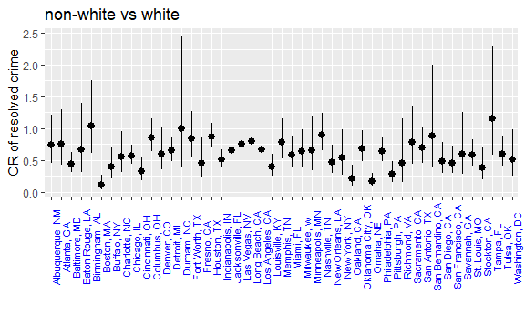
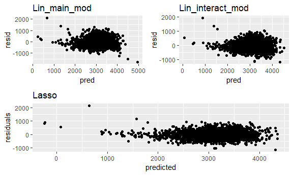
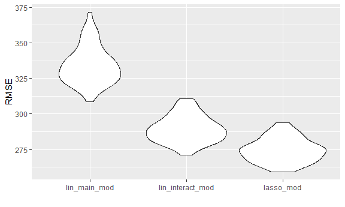

Homework 6
================
Anusorn Thanataveerat
November 15, 2018

true

Problem 1
---------

``` r
homicide_dat <-
  read_csv('https://raw.githubusercontent.com/washingtonpost/data-homicides/master/homicide-data.csv') %>% 
  mutate(reported_date = ymd(reported_date), 
         city_state = paste(city, state, sep = ', '),
         victim_race = factor(ifelse(victim_race != 'White', 'non-white', 'white'),
        #Set white as reference group   
        levels = c('white', 'non-white')),
        victim_age = as.numeric(victim_age),
        resolved = ifelse(disposition == "Closed by arrest", 1, 0)) %>% 
        #fllter the following cities out
      filter(!(city_state %in% c('Dallas, TX', 'Phoenix, AZ', 'Kansas City, MO', 'Tulsa, AL')))
```

    ## Warning: 2 failed to parse.

    ## Warning in evalq(as.numeric(victim_age), <environment>): NAs introduced by
    ## coercion

Look at the city of Baltimore data and fit the logistic regression

``` r
baltimore_logistic <- homicide_dat %>% 
  filter(city_state == 'Baltimore, MD') %>% 
  glm(resolved ~ victim_age + victim_sex + victim_race,
      family = binomial(link = 'logit'), data = .) 

 baltimore_logistic %>% 
  broom::tidy() %>% 
  mutate(OR = exp(estimate)) %>%
  bind_cols(.,  exp(confint_tidy(baltimore_logistic))) %>% 
  select(term, OR, conf.low, conf.high) %>% 
  filter(term == 'victim_racenon-white') %>% 
  knitr::kable(digits = 3)
```

| term                  |     OR|  conf.low|  conf.high|
|:----------------------|------:|---------:|----------:|
| victim\_racenon-white |  0.441|     0.312|       0.62|

The odds ratios of solving homicides comparing non-white victims to white victims keeping all other variables fixed is 0.44 (0.31, 0.62).

``` r
#Function of fitting glm and produce OR with CI
glm_or_ci_function <- function(dat){
  logistic <- glm(resolved ~ victim_age + victim_sex + victim_race,
      family = binomial(link = 'logit'), data = dat) 

 logistic %>% 
  broom::tidy() %>% 
  mutate(OR = exp(estimate)) %>%
  bind_cols(.,  exp(confint_tidy(logistic))) %>% 
  select(term, OR, conf.low, conf.high) %>% 
  filter(term == 'victim_racenon-white')
}

 ORs_df <- homicide_dat %>% 
   select(victim_age, victim_race, victim_sex, resolved, city_state) %>% 
  nest(., victim_age:resolved) %>% 
   mutate(models = map(data, glm_or_ci_function)) 
 
 ORs_df %>% 
   select(-data) %>% 
   unnest() %>% 
   mutate(city_state = fct_reorder(city_state, OR)) %>%  
   ggplot(aes(x = city_state, y = OR)) +
   geom_pointrange(aes(ymin = conf.low, ymax = conf.high)) +
   geom_hline(yintercept = 1, linetype = "dotdash", 
              color = "red", size = 0.6) +
   ylab('OR of resolved crime') + 
   xlab('') +
   ggtitle('non-white vs white') +
   theme(axis.text.x = element_text(color = "blue", size = 8, angle = 90))
```



Comment: The odds of solving crimes for non-white victims are lower in every city except Durham, NC, Birminngham, AL and Tampa, FL. However, the odds for those three cities are not statistically higher. On the other hand, a majority of cities has lower odds for solving cases for non-white vicitims with statistical significance (here is the list)

``` r
ORs_df %>% 
   select(-data) %>% 
   unnest() %>% 
  filter(conf.high < 1) %>% 
  select(city_state) %>% 
  kable()
```

| city\_state       |
|:------------------|
| Baltimore, MD     |
| Boston, MA        |
| Buffalo, NY       |
| Charlotte, NC     |
| Chicago, IL       |
| Cincinnati, OH    |
| Detroit, MI       |
| Fresno, CA        |
| Indianapolis, IN  |
| Jacksonville, FL  |
| Las Vegas, NV     |
| Los Angeles, CA   |
| Louisville, KY    |
| Miami, FL         |
| Milwaukee, wI     |
| New Orleans, LA   |
| New York, NY      |
| Oakland, CA       |
| Oklahoma City, OK |
| Omaha, NE         |
| Philadelphia, PA  |
| Pittsburgh, PA    |
| San Diego, CA     |
| San Francisco, CA |
| St. Louis, MO     |
| Stockton, CA      |
| Tulsa, OK         |
| Washington, DC    |

Among the cities with dismal odds for non-white victims, Boston, MA seems to have worst odds for solving crimes if the victims are non-white.

``` r
ORs_df %>% 
  select(-data) %>% 
  unnest() %>% 
  arrange(OR) %>% 
  slice(1)
```

    ## # A tibble: 1 x 5
    ##   city_state term                    OR conf.low conf.high
    ##   <chr>      <chr>                <dbl>    <dbl>     <dbl>
    ## 1 Boston, MA victim_racenon-white 0.115   0.0425     0.259

Problem 2
---------

``` r
dat <- read_csv('data/birthweight.csv') %>%
  mutate_at(c('babysex', 'frace', 'malform', 'mrace'), 
            funs(factor(.))) %>%
  mutate(smoke = as.factor(ifelse(smoken > 0, 1, 0)),
  id = row_number()) %>%
  select(-smoken)
```

    ## Parsed with column specification:
    ## cols(
    ##   .default = col_integer(),
    ##   gaweeks = col_double(),
    ##   ppbmi = col_double(),
    ##   smoken = col_double()
    ## )

    ## See spec(...) for full column specifications.

First I created a new smoking variable (binary) from `smoken` since the data is zero heavy and wouldn't make much sense to try to establish a linear relationship between `smoken` and the outcome. Next I checked the missingness in the dataset and it appeared to contain no missing information.

I proposed a Lasso model to predict the birth weight since the algorithm takes care of predictors selection by regularizing the coefficient estimates of the predictors that are not predictive and also reduce the variance of the prediction. The method is data driven and therefore doesn't rely on any hypotheses.

``` r
library(glmnet)
```

    ## Loading required package: Matrix

    ## 
    ## Attaching package: 'Matrix'

    ## The following object is masked from 'package:tidyr':
    ## 
    ##     expand

    ## Loading required package: foreach

    ## 
    ## Attaching package: 'foreach'

    ## The following objects are masked from 'package:purrr':
    ## 
    ##     accumulate, when

    ## Loaded glmnet 2.0-16

``` r
#Prepare train, test data 
set.seed(1)
train_df = sample_frac(dat, 0.8)
test_df = anti_join(dat, train_df, by = "id")
#prepare data for the model - matrix of predictors
x_train <- model.matrix(bwt ~ . -id, train_df)[, -1] #don't want intercept column here
y_train <- train_df$bwt  #outcome of interest

#Find the best tuning parameter using cross-validation (minimize the MSE)
set.seed(2)
lasso_cv <- cv.glmnet(x_train, y_train, alpha = 1)

#The best lambda
best_cv <- glance(lasso_cv) %>% pull(lambda.min)

#fit the best lambda on the training set
lasso_mod <- glmnet(x_train, y_train, alpha = 1, lambda = best_cv)
```

Modeling Process
----------------

First I split the dataset into traing and test set with 80:20 allocation. Then using the training set, I came up with the optimal lambda (tuning parameter) which minimize the MSE using the cross-validation method. The best lamda derived is 1.3457781. and the model estimates are:

``` r
lasso_mod %>% tidy() %>% kable()
```

| term        |  step|       estimate|    lambda|  dev.ratio|
|:------------|-----:|--------------:|---------:|----------:|
| (Intercept) |     1|  -6106.8230689|  1.345778|  0.7294922|
| babysex2    |     1|     29.9827961|  1.345778|  0.7294922|
| bhead       |     1|    128.5752410|  1.345778|  0.7294922|
| blength     |     1|     79.7146876|  1.345778|  0.7294922|
| delwt       |     1|      1.4733560|  1.345778|  0.7294922|
| fincome     |     1|      0.4077175|  1.345778|  0.7294922|
| frace4      |     1|    -46.9717203|  1.345778|  0.7294922|
| gaweeks     |     1|     11.0169930|  1.345778|  0.7294922|
| malform1    |     1|    -31.4947947|  1.345778|  0.7294922|
| menarche    |     1|     -3.1983855|  1.345778|  0.7294922|
| mheight     |     1|      4.9702949|  1.345778|  0.7294922|
| mrace2      |     1|   -127.3389770|  1.345778|  0.7294922|
| mrace3      |     1|    -61.1670155|  1.345778|  0.7294922|
| mrace4      |     1|    -54.4799933|  1.345778|  0.7294922|
| parity      |     1|     92.4764415|  1.345778|  0.7294922|
| wtgain      |     1|      2.5066225|  1.345778|  0.7294922|
| smoke1      |     1|    -54.1307647|  1.345778|  0.7294922|

`momage, pnumlbw, pnumsgsa, ppbmi` and `ppwt` were excluded from the final model. Some of the categories for father's race (Black, Asian) were not significantly different from the base case (White) so they were excluded as well. The predictors with positive correlation on the birth weight were `babysex (female), bhead, blength, delwt, fincome, gaweeks, mheight, parity, wtgain`, and those with negative correlation were `frace (Puerto Rican), malform (present), menarche, mrace (non-White), smoke`.

plot of model residuals against fitted values on the test data from 3 models

*Since the homework explicitly suggests the use of `add_prediction` and `add_residuals`, I'll use those to plot the two models since Lasso package (glmnet) doesn't support the above function*

``` r
#Since add_predictions and residuals do not support the glmnet package, we'll take a different route
new_train_df <- train_df %>% 
  bind_cols(., predicted = predict(lasso_mod, x_train)) %>% 
  mutate(residuals = bwt - predicted)
# Residual = Observed value - Predicted value 
plot1 = ggplot(data = new_train_df, aes(x = predicted, y = residuals)) +
    geom_point() + ggtitle('Lasso')

#Consider other 2 models
#One using length at birth and gestational age as predictors (main effects only)
lin_main_mod <- lm(bwt ~ blength + gaweeks, data = train_df)
# One using head circumference, length, sex, and all interactions (including the three-way interaction) between these
lin_interact_mod <- lm(bwt ~ blength*bhead*babysex, data = train_df)

plot2 = train_df %>% add_predictions(lin_main_mod) %>% 
  add_residuals(lin_main_mod) %>% 
  ggplot(aes(x = pred, y = resid)) + 
  geom_point() + ggtitle('Lin_main_mod')

plot3 <- train_df %>% add_predictions(lin_interact_mod) %>% 
  add_residuals(lin_interact_mod) %>% 
  ggplot(aes(x = pred, y = resid)) + 
  geom_point() + ggtitle('Lin_interact_mod')

(plot2 + plot3) / plot1
```



*Comment* on the Lasso plot: My Lasso case has some unrealistic predicted values which are negative (2 values). This didn't occur in the linear model cases. I also spotted outliers (the fist 4 observations to the left of the Lasso figure). The variability of residuals when the predicted value &gt; 2500 and &lt; 4000 is pretty constant. Meaning that we can be confident when our predicted values are between the said range.

``` r
cv_df <- crossv_mc(dat, 100) %>% 
  mutate(train = map(train, as_tibble),
         test = map(test, as_tibble))

#Write function so that glmnet can operate in map context
lasso_mod_func <- function(train, test){
  #set up matrix for training set
  x <- model.matrix(bwt ~ . -id, train)[, -1] #don't want intercept column here
  y <- train$bwt  #outcome of interest
  lasso_mod <- glmnet(x, y, alpha = 1, lambda = best_cv)
  #set up matrix for test set
  x_test <- model.matrix(bwt ~ . -id, test)[, -1]
  y_test <- test$bwt
  predicted <- predict(lasso_mod, x_test)
  rmse_lasso_mod <- sqrt(sum((predicted - y_test)^2)/length(y_test))
  return(rmse_lasso_mod)
}

cv_df = 
  cv_df %>% 
  mutate(lin_main_mod = map(train, ~lm(bwt ~ blength + gaweeks, data = .x)),
         lin_interact_mod = map(train, ~lm(bwt ~ blength*bhead*babysex, data = .x))) %>% 
  mutate(rmse_lin_main_mod = map2_dbl(lin_main_mod, test, ~rmse(model = .x, data = .y)),
         rmse_lin_interact_mod = map2_dbl(lin_interact_mod, test, ~rmse(model = .x, data = .y)),
         rmse_lasso_mod = map2_dbl(train, test, ~lasso_mod_func(train = .x, test = .y)))

cv_df %>% 
  select(starts_with("rmse")) %>% 
  gather(key = model, value = rmse) %>% 
  mutate(model = str_replace(model, "rmse_", ""),
         model = fct_inorder(model)) %>% 
  ggplot(aes(x = model, y = rmse)) + geom_violin() +
  ylab('RMSE') + xlab('')
```



My Lasso model performed better- with an average RMSE from the CV process 275- than the linear model with interaction terms (mean RMSE = 289) which in turn performed better than the linear model without the interaction term (mean RMSE = 334).
