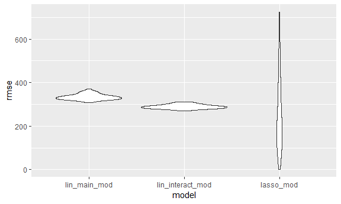

Homework 6
================
Anusorn Thanataveerat
November 15, 2018

true

Problem 1
---------

``` r
homicide_dat <-
  read_csv('https://raw.githubusercontent.com/washingtonpost/data-homicides/master/homicide-data.csv') %>% 
  mutate(reported_date = ymd(reported_date), 
         city_state = paste(city, state, sep = ', '),
         victim_race = factor(ifelse(victim_race != 'White', 'non-white', 'white'),
        #Set white as reference group   
        levels = c('white', 'non-white')),
        victim_age = as.numeric(victim_age),
        resolved = ifelse(disposition == "Closed by arrest", 1, 0)) %>% 
        #fllter the following cities out
      filter(!(city_state %in% c('Dallas, TX', 'Phoenix, AZ', 'Kansas City, MO', 'Tulsa, AL')))
```

    ## Warning: 2 failed to parse.

    ## Warning in evalq(as.numeric(victim_age), <environment>): NAs introduced by
    ## coercion

Look at the city of Baltimore data and fit the logistic regression

``` r
baltimore_logistic <- homicide_dat %>% 
  filter(city_state == 'Baltimore, MD') %>% 
  glm(resolved ~ victim_age + victim_sex + victim_race,
      family = binomial(link = 'logit'), data = .) 

 baltimore_logistic %>% 
  broom::tidy() %>% 
  mutate(OR = exp(estimate)) %>%
  bind_cols(.,  exp(confint_tidy(baltimore_logistic))) %>% 
  select(term, OR, conf.low, conf.high) %>% 
  filter(term == 'victim_racenon-white') %>% 
  knitr::kable(digits = 3)
```

| term                  |     OR|  conf.low|  conf.high|
|:----------------------|------:|---------:|----------:|
| victim\_racenon-white |  0.441|     0.312|       0.62|

The odds ratios of solving homicides comparing non-white victims to white victims keeping all other variables fixed is 0.44 (0.31, 0.62).

``` r
#Function of fitting glm and produce OR with CI
glm_or_ci_function <- function(dat){
  logistic <- glm(resolved ~ victim_age + victim_sex + victim_race,
      family = binomial(link = 'logit'), data = dat) 

 logistic %>% 
  broom::tidy() %>% 
  mutate(OR = exp(estimate)) %>%
  bind_cols(.,  exp(confint_tidy(logistic))) %>% 
  select(term, OR, conf.low, conf.high) %>% 
  filter(term == 'victim_racenon-white')
}

 ORs_df <- homicide_dat %>% 
   select(victim_age, victim_race, victim_sex, resolved, city_state) %>% 
  nest(., victim_age:resolved) %>% 
   mutate(models = map(data, glm_or_ci_function)) 
 
 ORs_df %>% 
   select(-data) %>% 
   unnest() %>% 
   ggplot(aes(x = city_state, y = OR)) +
   geom_pointrange(aes(ymin = conf.low, ymax = conf.high)) +
   geom_hline(yintercept = 1, linetype = "dotdash", 
              color = "red", size = 0.6) +
   ylab('OR of resolved crime') + 
   xlab('') +
   ggtitle('non-white vs white') +
   theme(axis.text.x = element_text(color = "blue", size = 8, angle = 90))
```


Comment: main estimates: mostly below 1. those with statistically sig are xxx . some noteworthy city where the trend is reversed abc

Problem 2
---------

``` r
dat <- read_csv('data/birthweight.csv') %>%
  mutate_at(c('babysex', 'frace', 'malform', 'mrace'), 
            funs(factor(.))) %>%
  mutate(smoke = as.factor(ifelse(smoken > 0, 1, 0)),
  id = row_number()) %>%
  select(-smoken)
```

    ## Parsed with column specification:
    ## cols(
    ##   .default = col_integer(),
    ##   gaweeks = col_double(),
    ##   ppbmi = col_double(),
    ##   smoken = col_double()
    ## )

    ## See spec(...) for full column specifications.

``` r
#check for missing data
skimr::skim(dat)
```

    ## Skim summary statistics
    ##  n obs: 4342 
    ##  n variables: 21 
    ## 
    ## -- Variable type:factor --------------------------------------------------------------------------------
    ##  variable missing complete    n n_unique                      top_counts
    ##   babysex       0     4342 4342        2         1: 2230, 2: 2112, NA: 0
    ##     frace       0     4342 4342        5 1: 2123, 2: 1911, 4: 248, 3: 46
    ##   malform       0     4342 4342        2           0: 4327, 1: 15, NA: 0
    ##     mrace       0     4342 4342        4 1: 2147, 2: 1909, 4: 243, 3: 43
    ##     smoke       0     4342 4342        2         0: 2552, 1: 1790, NA: 0
    ##  ordered
    ##    FALSE
    ##    FALSE
    ##    FALSE
    ##    FALSE
    ##    FALSE
    ## 
    ## -- Variable type:integer -------------------------------------------------------------------------------
    ##  variable missing complete    n      mean      sd  p0     p25    p50
    ##     bhead       0     4342 4342   33.65      1.62  21   33      34  
    ##   blength       0     4342 4342   49.75      2.72  20   48      50  
    ##       bwt       0     4342 4342 3114.4     512.15 595 2807    3132.5
    ##     delwt       0     4342 4342  145.57     22.21  86  131     143  
    ##   fincome       0     4342 4342   44.11     25.98   0   25      35  
    ##        id       0     4342 4342 2171.5    1253.57   1 1086.25 2171.5
    ##  menarche       0     4342 4342   12.51      1.48   0   12      12  
    ##   mheight       0     4342 4342   63.49      2.66  48   62      63  
    ##    momage       0     4342 4342   20.3       3.88  12   18      20  
    ##    parity       0     4342 4342    0.0023    0.1    0    0       0  
    ##   pnumlbw       0     4342 4342    0         0      0    0       0  
    ##   pnumsga       0     4342 4342    0         0      0    0       0  
    ##      ppwt       0     4342 4342  123.49     20.16  70  110     120  
    ##    wtgain       0     4342 4342   22.08     10.94 -46   15      22  
    ##      p75 p100     hist
    ##    35      41 <U+2581><U+2581><U+2581><U+2581><U+2585><U+2587><U+2581><U+2581>
    ##    51      63 <U+2581><U+2581><U+2581><U+2581><U+2581><U+2587><U+2581><U+2581>
    ##  3459    4791 <U+2581><U+2581><U+2581><U+2583><U+2587><U+2587><U+2582><U+2581>
    ##   157     334 <U+2581><U+2587><U+2585><U+2581><U+2581><U+2581><U+2581><U+2581>
    ##    65      96 <U+2581><U+2582><U+2587><U+2582><U+2582><U+2582><U+2581><U+2583>
    ##  3256.75 4342 <U+2587><U+2587><U+2587><U+2587><U+2587><U+2587><U+2587><U+2587>
    ##    13      19 <U+2581><U+2581><U+2581><U+2581><U+2582><U+2587><U+2581><U+2581>
    ##    65      77 <U+2581><U+2581><U+2581><U+2585><U+2587><U+2582><U+2581><U+2581>
    ##    22      44 <U+2582><U+2587><U+2585><U+2582><U+2581><U+2581><U+2581><U+2581>
    ##     0       6 <U+2587><U+2581><U+2581><U+2581><U+2581><U+2581><U+2581><U+2581>
    ##     0       0 <U+2581><U+2581><U+2581><U+2587><U+2581><U+2581><U+2581><U+2581>
    ##     0       0 <U+2581><U+2581><U+2581><U+2587><U+2581><U+2581><U+2581><U+2581>
    ##   134     287 <U+2581><U+2587><U+2586><U+2581><U+2581><U+2581><U+2581><U+2581>
    ##    28      89 <U+2581><U+2581><U+2581><U+2587><U+2587><U+2581><U+2581><U+2581>
    ## 
    ## -- Variable type:numeric -------------------------------------------------------------------------------
    ##  variable missing complete    n  mean   sd    p0   p25   p50   p75 p100
    ##   gaweeks       0     4342 4342 39.43 3.15 17.7  38.3  39.9  41.1  51.3
    ##     ppbmi       0     4342 4342 21.57 3.18 13.07 19.53 21.03 22.91 46.1
    ##      hist
    ##  <U+2581><U+2581><U+2581><U+2581><U+2583><U+2587><U+2581><U+2581>
    ##  <U+2581><U+2587><U+2585><U+2581><U+2581><U+2581><U+2581><U+2581>

First create smoking binary variable from `smoken` since the data is zero heavy and wouldn't make much sense to try to establish a linear relationship between that and the outcome. Also, the data doesn't appear to contain missing information so we're good

Propose a regression model for birthweight: Lasso: takes care of predictors selection by regularizing the coefficient estimates of the predictors that are not predictive and also reduce the variance of the prediction. Data driven

``` r
library(glmnet)
```

    ## Loading required package: Matrix

    ## 
    ## Attaching package: 'Matrix'

    ## The following object is masked from 'package:tidyr':
    ## 
    ##     expand

    ## Loading required package: foreach

    ## 
    ## Attaching package: 'foreach'

    ## The following objects are masked from 'package:purrr':
    ## 
    ##     accumulate, when

    ## Loaded glmnet 2.0-16

``` r
#Prepare train, test data 
set.seed(1)
train_df = sample_frac(dat, 0.8)
test_df = anti_join(dat, train_df, by = "id")
#prepare data for the model - matrix of predictors
x_train <- model.matrix(bwt ~ . -id, train_df)[, -1] #don't want intercept column here
y_train <- train_df$bwt  #outcome of interest

#Find the best tuning parameter using cross-validation (minimize the MSE)
set.seed(2)
lasso_cv <- cv.glmnet(x_train, y_train, alpha = 1)

#The best lambda
best_cv <- glance(lasso_cv) %>% pull(lambda.min)

#fit the best lambda on the training set
lasso_mod <- glmnet(x_train, y_train, alpha = 1, lambda = best_cv)
```

Walk through the steps of fitting the model

``` r
lasso_mod %>% tidy() %>% kable()
```

| term        |  step|       estimate|    lambda|  dev.ratio|
|:------------|-----:|--------------:|---------:|----------:|
| (Intercept) |     1|  -6106.8230689|  1.345778|  0.7294922|
| babysex2    |     1|     29.9827961|  1.345778|  0.7294922|
| bhead       |     1|    128.5752410|  1.345778|  0.7294922|
| blength     |     1|     79.7146876|  1.345778|  0.7294922|
| delwt       |     1|      1.4733560|  1.345778|  0.7294922|
| fincome     |     1|      0.4077175|  1.345778|  0.7294922|
| frace4      |     1|    -46.9717203|  1.345778|  0.7294922|
| gaweeks     |     1|     11.0169930|  1.345778|  0.7294922|
| malform1    |     1|    -31.4947947|  1.345778|  0.7294922|
| menarche    |     1|     -3.1983855|  1.345778|  0.7294922|
| mheight     |     1|      4.9702949|  1.345778|  0.7294922|
| mrace2      |     1|   -127.3389770|  1.345778|  0.7294922|
| mrace3      |     1|    -61.1670155|  1.345778|  0.7294922|
| mrace4      |     1|    -54.4799933|  1.345778|  0.7294922|
| parity      |     1|     92.4764415|  1.345778|  0.7294922|
| wtgain      |     1|      2.5066225|  1.345778|  0.7294922|
| smoke1      |     1|    -54.1307647|  1.345778|  0.7294922|

explain a bit about the model. what remains and what's missing and what's the effect of each variable

plot of model residuals against fitted values on the test data from 3 models

``` r
#Since add_predictions and residuals do not support the glmnet package, we'll take a different route
new_train_df <- train_df %>% 
  bind_cols(., predicted = predict(lasso_mod, x_train)) %>% 
  mutate(residuals = bwt - predicted)
# Residual = Observed value - Predicted value 
plot1 = ggplot(data = new_train_df, aes(x = predicted, y = residuals)) +
    geom_point() + ggtitle('Lasso')

#Consider other 2 models
#One using length at birth and gestational age as predictors (main effects only)
lin_main_mod <- lm(bwt ~ blength + gaweeks, data = train_df)
# One using head circumference, length, sex, and all interactions (including the three-way interaction) between these
lin_interact_mod <- lm(bwt ~ blength*bhead*babysex, data = train_df)

plot2 = train_df %>% add_predictions(lin_main_mod) %>% 
  add_residuals(lin_main_mod) %>% 
  ggplot(aes(x = pred, y = resid)) + 
  geom_point() + ggtitle('Lin_main_mod')

plot3 <- train_df %>% add_predictions(lin_interact_mod) %>% 
  add_residuals(lin_interact_mod) %>% 
  ggplot(aes(x = pred, y = resid)) + 
  geom_point() + ggtitle('lin_interact_mod')
```

Next we comparison of 3 models using RMSE

``` r
cv_df <- crossv_mc(dat, 100) %>% 
  mutate(train = map(train, as_tibble),
         test = map(test, as_tibble))

#Write function so that glmnet can operate in map context
lasso_mod_func <- function(train, test){
  #set up matrix for training set
  x <- model.matrix(bwt ~ . -id, train)[, -1] #don't want intercept column here
  y <- train$bwt  #outcome of interest
  lasso_mod <- glmnet(x, y, alpha = 1, lambda = best_cv)
  #set up matrix for test set
  x_test <- model.matrix(bwt ~ . -id, test)[, -1]
  y_test <- test$bwt
  predicted <- predict(lasso_mod, x_test)
  rmse_lasso_mod <- sqrt((sum(predicted - y_test)^2)/length(y_test))
  return(rmse_lasso_mod)
}

cv_df = 
  cv_df %>% 
  mutate(lin_main_mod = map(train, ~lm(bwt ~ blength + gaweeks, data = .x)),
         lin_interact_mod = map(train, ~lm(bwt ~ blength*bhead*babysex, data = .x))) %>% 
  mutate(rmse_lin_main_mod = map2_dbl(lin_main_mod, test, ~rmse(model = .x, data = .y)),
         rmse_lin_interact_mod = map2_dbl(lin_interact_mod, test, ~rmse(model = .x, data = .y)),
         rmse_lasso_mod = map2_dbl(train, test, ~lasso_mod_func(train = .x, test = .y)))

cv_df %>% 
  select(starts_with("rmse")) %>% 
  gather(key = model, value = rmse) %>% 
  mutate(model = str_replace(model, "rmse_", ""),
         model = fct_inorder(model)) %>% 
  ggplot(aes(x = model, y = rmse)) + geom_violin()
```



Comment of the violin figure
