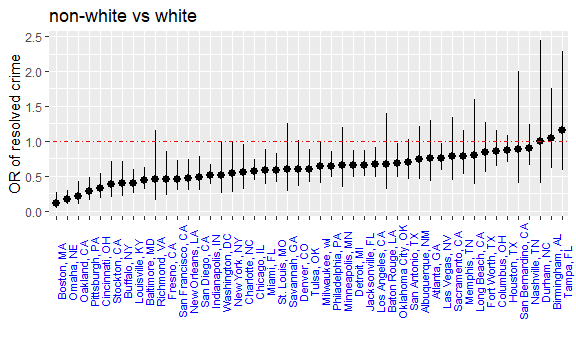

Homework 6
================
Anusorn Thanataveerat
November 15, 2018

true

Problem 1
---------

``` r
homicide_dat <-
  read_csv('https://raw.githubusercontent.com/washingtonpost/data-homicides/master/homicide-data.csv') %>% 
  mutate(reported_date = ymd(reported_date), 
         city_state = paste(city, state, sep = ', '),
         victim_race = factor(ifelse(victim_race != 'White', 'non-white', 'white'),
        #Set white as reference group   
        levels = c('white', 'non-white')),
        victim_age = as.numeric(victim_age),
        resolved = ifelse(disposition == "Closed by arrest", 1, 0)) %>% 
        #fllter the following cities out
      filter(!(city_state %in% c('Dallas, TX', 'Phoenix, AZ', 'Kansas City, MO', 'Tulsa, AL')))
```

    ## Warning: 2 failed to parse.

    ## Warning in evalq(as.numeric(victim_age), <environment>): NAs introduced by
    ## coercion

Look at the city of Baltimore data and fit the logistic regression

``` r
baltimore_logistic <- homicide_dat %>% 
  filter(city_state == 'Baltimore, MD') %>% 
  glm(resolved ~ victim_age + victim_sex + victim_race,
      family = binomial(link = 'logit'), data = .) 

 baltimore_logistic %>% 
  broom::tidy() %>% 
  mutate(OR = exp(estimate)) %>%
  bind_cols(.,  exp(confint_tidy(baltimore_logistic))) %>% 
  select(term, OR, conf.low, conf.high) %>% 
  filter(term == 'victim_racenon-white') %>% 
  knitr::kable(digits = 3)
```

| term                  |     OR|  conf.low|  conf.high|
|:----------------------|------:|---------:|----------:|
| victim\_racenon-white |  0.441|     0.312|       0.62|

The odds ratios of solving homicides comparing non-white victims to white victims keeping all other variables fixed is 0.44 (0.31, 0.62).

``` r
#Function of fitting glm and produce OR with CI
glm_or_ci_function <- function(dat){
  logistic <- glm(resolved ~ victim_age + victim_sex + victim_race,
      family = binomial(link = 'logit'), data = dat) 

 logistic %>% 
  broom::tidy() %>% 
  mutate(OR = exp(estimate)) %>%
  bind_cols(.,  exp(confint_tidy(logistic))) %>% 
  select(term, OR, conf.low, conf.high) %>% 
  filter(term == 'victim_racenon-white')
}

 ORs_df <- homicide_dat %>% 
   select(victim_age, victim_race, victim_sex, resolved, city_state) %>% 
  nest(., victim_age:resolved) %>% 
   mutate(models = map(data, glm_or_ci_function)) 
 
 ORs_df %>% 
   select(-data) %>% 
   unnest() %>% 
   ggplot(aes(x = city_state, y = OR)) +
   geom_pointrange(aes(ymin = conf.low, ymax = conf.high)) +
   ylab('OR of resolved crime') + 
   xlab('') +
   ggtitle('non-white vs white') +
   theme(axis.text.x = element_text(color = "blue", size = 8, angle = 90))
```



Comment:
